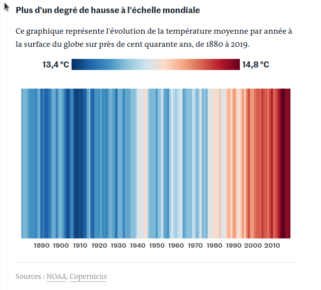
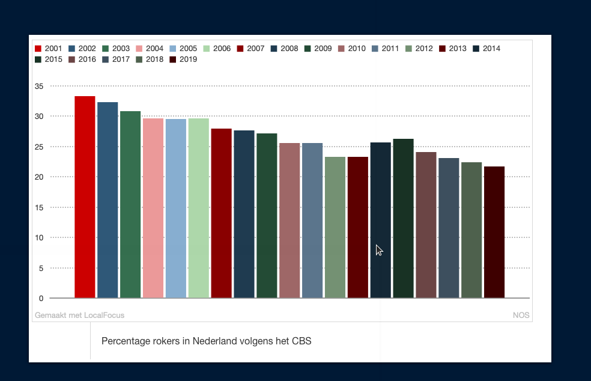
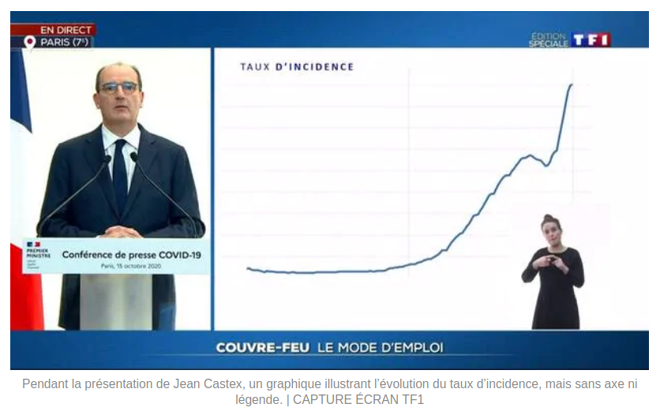

```{r setup,   cahe = FALSE, eval = TRUE, echo = FALSE, message = FALSE}
library(flipbookr)
library(RefManageR)
library(kableExtra)
source(paste0(params$setup_path, "knitr_setup.R"))
with_sol <- FALSE ## in order to control the output
with_course <- TRUE
```


```{r reference,  include=FALSE, cache=FALSE, eval = TRUE}
BibOptions(check.entries = FALSE,
           bib.style = "authoryear",
           cite.style = "alphabetic",
           style = "markdown",
           hyperlink = FALSE,
           dashed = FALSE)
myBib <- ReadBib("./visu.bib", check = FALSE)
theme_set(theme_grey())
```


name: intro
count: false

# Introduction

---
template: intro 

## Pourquoi la visualisation des données est importante ?

<br>  <br> 


- La chronique de Constance par Constance dans  Par Jupiter 

<br>

<audio controls>
  <source src="2020_10_27_Constance_Par_Jupiter.mp3" type="audio/mpeg">
  <source src="2020_10_27_Constance_Par_Jupiter" type="audio/ogg"/>
</audio>

---
template: intro 

## Un exemple inspirant : le réchauffement climatique en une image 

```{r le_monde_graph, eval = TRUE, echo = FALSE}
# All defaults

```


[Extrait du journal Le Monde le 3 janvier 2020](https://www.lemonde.fr/les-decodeurs/article/2020/01/03/2019-est-la-troisieme-annee-la-plus-chaude-en-france-visualisez-la-hausse-dans-votre-ville_6024699_4355770.html?xtor=CS2-33281034-%5BKW%5D-%5Bgratuit%5D-%5Barticleacquisition%5D&utm_campaign=keywee_acquisition&utm_medium=PaidSocial&utm_source=Facebook&kwp_0=1527732&kwp_4=4629376&kwp_1=1961091)

--

<p class="question"> Qu'est ce qui est efficace dans cette visualisation ? </p>


---
template: intro 

## Le musée des horreurs

- [Le pourcentage de fumeurs aux Pays-Bas](https://viz.wtf/image/630887965804150786)

```{r smockers, eval = TRUE, echo = FALSE}
# All defaults

```


---
template: intro 
count: false

## Le musée des horreurs

- [Le Tumblr WTFViz](https://viz.wtf/)
- [Probabilité d'infection par le coronavirus par G. Forestier](https://i.redd.it/b3vvel2xtsv51.jpg)

```{r gf, eval = TRUE, echo = FALSE, out.width = '90%', out.height = '40%'   }
# All defaults
knitr::include_graphics("images/corona_gf.png")
```


---
template: intro 
count: false

## Le musée des horreurs

- [Le Tumblr WTFViz](https://viz.wtf/)
- [Probabilité d'infection par le coronavirus par G. Forestier](https://i.redd.it/b3vvel2xtsv51.jpg)
- [Le coronavirus par Jean Castex](https://www.ouest-france.fr/sante/virus/coronavirus/covid-19-couvre-feu-que-voulaient-dire-les-droles-de-graphiques-montres-par-jean-castex-7016245)

```{r jc, eval = TRUE, echo = FALSE}
# All defaults

```

---
template: intro 

## Quels sont les éléments d'une visualisation efficace ?

- $$ $$
- $$ $$ 
- $$ $$
- $$ $$
- $$ $$ 
- $$ $$
- $$ $$

--

.care[ Objectif du jour :]
Acquérir des outils pour gérer ces différents aspects

---
template: intro 


## Some resources

- [Data visualization with R](https://rkabacoff.github.io/datavis/)
- [R for Data Science](https://r4ds.had.co.nz/) `r Citep(myBib, "wickham2017R")`
- [R Graphics Cookbook](http://www.cookbook-r.com/)
- [ggplot2: Elegant Graphics for Data Analysis](https://ggplot2-book.org/index.html) `r Citep(myBib, "wickham2016ggplot2")`
- [R graph gallery](https://www.r-graph-gallery.com/ggplot2-package.html)
- [Tutoriel de Raphaelle Momal et Marie Perrot Dockes](https://stateofther.github.io/post/fancy-plotting/)
- [Don’t cha wish your ggplot had colours like me?](https://www.dataembassy.co.nz/Liza-colours-in-R#22)
- [Valoriser ses données avec R](https://mtes-mct.github.io/parcours-r/m5/) (formation du  Ministere de la Transition Écologique et Solidaire (MTES)  et du Ministère de la Cohésion des Territoires et des relations avec les collectivités territoriales (MCTRCT))

---
name: manip
# Data manipulation

---
template: manip

The tidyverse is designed to facilitate data manipulation and we will use  the `%>%` operator.


```{r load_tidyverse, message = FALSE, eval = TRUE, echo = TRUE}
library(tidyverse)
```


```{r tidy_pres1, eval = TRUE, echo = FALSE, out.width = '60%', out.height = '40%'   }
# All defaults
knitr::include_graphics("images/data-science.png")
```


---
template: manip

The tidyverse is designed to facilitate data manipulation and we will use  the `%>%` operator.


```{r load_tidyverse2, message = FALSE, eval = TRUE, echo = TRUE}
library(tidyverse)
```


```{r tidy_pres2, eval = TRUE, echo = FALSE, out.width = '80%', out.height = '60%', fig.cap='Extract from https://mtes-mct.github.io/parcours-r/m5/package-ggplot2.html' }
# All defaults
knitr::include_graphics("images/tidyverse.png")
```
---
template: manip

## The %>% operator

```{r tidy_ex_echo, echo = TRUE}
set.seed(1)
n <- 8
data.frame(x = sample(1:10, size = n, replace = TRUE), 
           y = 3*rnorm(n)) %>% 
  mutate(xplusy = x + y ) %>% 
  filter( xplusy > 4) %>% 
  select(x, y)
```

---

```{r tidy_ex}
set.seed(1)
n <- 8
data.frame(x = sample(1:10, size = n, replace = TRUE), y = 3*rnorm(n)) %>% 
  mutate(xplusy = x + y ) %>% 
  filter( xplusy > 4) %>% 
  select(x, y)
```

---

`r chunk_reveal("tidy_ex", break_type = "auto")`

---
template: manip

## Useful commands 

- `mutate` to create a new column,
- `filter` to select lines according to some conditions,
- `select` to select some columss,

--

- `rename` to rename variables,
- `group_by`  for grouping factor,
- `summarise` to cumputate summary statistics,
- ...


---
template: manip
## First running example:  The Palmer Penguins dataset


```{r palmer_data, eval = TRUE, echo = TRUE}
#remotes::install_github("allisonhorst/palmerpenguins")
data(penguins,package = "palmerpenguins")
penguins <- penguins %>%
  rename(bill_l = bill_length_mm, bill_d = bill_depth_mm, flip_l = flipper_length_mm, bm = body_mass_g)
penguins %>%
  print(n=2)
```

---
template: manip
## A case study running example:  The bats dataset


```{r bats_data, eval = TRUE, echo = TRUE}
data(bats,package = "coursesdata")
bats %>%   as_tibble() %>% print(n = 2, na.print = NULL)
```


---
template: manip

##  Combining group_by, mutate and summarise 


```{r show_data_palmer, eval = TRUE, echo = TRUE}

penguins %>%
  group_by(species, sex, year, island) %>%
  mutate(n = n()) %>%
  summarise_if(is.numeric, mean, na.rm = TRUE) %>%
  print(n=10)
```


```{r show_data_palmer_flip}

penguins %>%
  group_by(species, sex, year, island) %>%
  mutate(n = n()) %>%
  summarise_if(is.numeric, mean, na.rm = TRUE) %>%
  print(n=10)
```


---

`r chunk_reveal("show_data_palmer_flip", break_type = "auto")`

---
template: manip
class: inverse

```{r otter, eval = TRUE, echo = FALSE}
# All defaults

```

.center[.highlight[Your turn!]]

---
template: manip
class: inverse


##  Combining group_by, mutate and summarise - Your turn!

1. create a Diet_fact colum, where Diet is understood as a factor
2. count the number of species by Diet
3. Compute the average body weight per Diet, and per Diet x Clade
4. Compute the mean and standard deviation for Brain weight per Diet


---
name: ggplot
# Visualization thanks to ggplot


---
template: ggplot

gg stands for Grammar of Graphics  and  ggplot2  is *based on the Grammar of Graphics `r Citep(myBib, "wilkinson2005gramma")`, that allows you to compose graphs by combining independent components* `r Citep(myBib, "wickham2016ggplot2")`.

*[The] grammar tells us that a graphic maps the*
- *data* 
- *to the aesthetic attributes (colour, shape, size)* 
- *of geometric objects (points, lines, bars)*. 
- *The plot may also include statistical transformations of the data and information about the plot’s coordinate system*.
- *Facetting can be used to plot for different subsets of the data.* 
*The combination of these independent components are what make up a graphic.*  `r Citep(myBib, "ickham2016ggplot2")`.


---
 
# Simple plots 

---
name: scatter_slide
# A scatter plot

```{r simple_scatter}
penguins %>% 
  ggplot() + 
  aes( x= bill_l, y=bill_d) + 
  geom_point()
```

---

`r chunk_reveal("simple_scatter", break_type = "auto")`

---

---
name: scatter_slide_col
# A colored scatter plot


```{r scatter_plot_species}
penguins %>% 
  ggplot() +
  aes( x= bill_l, y=bill_d) +
  geom_point() + #BREAK
  aes(col = species)  #BREAK
```

---

`r chunk_reveal("scatter_plot_species", break_type = "user")`

---
template: scatter_slide_col
count: false


```{r gg1_save, eval = TRUE, echo = TRUE}
gg <- penguins %>% 
  ggplot() +
  aes( x= bill_l, y=bill_d) +
  geom_point() + 
  aes(col = species)  
```


## with a color blind compliant palette


---

```{r scatter_viridis}
gg + 
  scale_color_viridis_d()
```

`r chunk_reveal("scatter_viridis", break_type = "auto")`

---
template: scatter_slide_col
count: false

##  with a color tribute to [Wes Anderson](https://en.wikipedia.org/wiki/Wes_Anderson) 

Following  a Tumblr blog  [Wes Anderson Palettes](https://wesandersonpalettes.tumblr.com/), Karthik Ram proposes the [wesanderson palette](https://github.com/karthik/wesanderson) on Github.


```{r scatter_define_palette_wesanderson,eval = TRUE, echo = TRUE}
## remotes::install_github("wesanderson")
color_darj <- wesanderson::wes_palette(name = "Darjeeling1")
```

---

```{r scatter_wesanderson}
gg + 
  scale_color_manual(values = color_darj)
```


`r chunk_reveal("scatter_wesanderson", break_type = "auto")`


---
template: scatter_slide_col
class: inverse

```{r seal, eval = TRUE, echo = FALSE}
# All defaults
knitr::include_graphics("images/seal.jpg")
```

.center[.highlight[Your turn!]]


---
class: inverse
template: scatter_slide_col
count: true

## Visualizing the relation between Body weight and Brain weight among bats species

Propose a fancy graph to visualize the relation between Brain weight and Body weight. Does this relation differs between Diets ?


---
template: scatter_slide_col
count: true

Propose a fancy graph to visualize the relation between flipper and body mass. Does this relation change over year ?


```{r exo_relation_cor, eval =  TRUE, echo = with_sol}
penguins %>% ggplot() +
  aes(x= bm, y = flip_l, col = as_factor(year) ) + 
  geom_point() + 
  scale_color_manual(values = wesanderson::wes_palette(name = "Zissou1"))

```


---
template: scatter_slide_col

## Some nice color palette
- [Inspired by Ghibli](https://github.com/ewenme/ghibli)
- [The yarr pirate palette](https://cran.r-project.org/web/packages/yarrr/vignettes/piratepal.html)
- [Harry Potter inspiration](https://github.com/aljrico/harrypotter)


---
name: scatter_slide_lab
count: true

# Properly labeled colored graph

---
template: scatter_slide_lab


```{r scatter_labels_gg, eval = TRUE, echo = TRUE}
gg <- gg + scale_color_manual(values = wesanderson::wes_palette(name = "Zissou1"))
```


---

```{r scatter_labels}
gg  +
  labs( x = 'Bill length in mm') +
  labs(y = 'Bill depth in mm') +
  labs(color = "Species")
```

`r chunk_reveal("scatter_labels", break_type = "auto")`


---
template: scatter_slide_lab
count: true

## using  a pre-set general theme

---

```{r scatter_themelight}
gg  +
  labs( x = 'Bill length in mm') +
  labs(y = 'Bill depth in mm') +
  labs(color = "Species") + #BREAK
  theme_light() #BREAK
```


`r chunk_reveal("scatter_themelight", break_type = "user")`

---
template: scatter_slide_lab
count: false

## and another pre set general theme


---

```{r scatter_thememinimal_show, eval = TRUE, echo = TRUE}
gg  +
  labs( x = 'Bill length in mm',  
        y = 'Bill depth in mm',  color = "Species") +
  theme_light() + 
  theme_minimal() 
```

---

```{r scatter_thememinimal}
gg  +
  labs( x = 'Bill length in mm',  
        y = 'Bill depth in mm',  color = "Species") +
  theme_light() + #BREAK 
  theme_minimal() #BREAK 
```


`r chunk_reveal("scatter_thememinimal", break_type = "user")`

---
template: scatter_slide_lab
count: false

## and a pre set general theme


```{r scatter_set_theme, eval = TRUE, echo = TRUE}
gg <- gg  +
  labs( x = 'Bill length in mm',  y = 'Bill depth in mm',  color = "Species") +
  theme_light()
```

---
template: scatter_slide_lab
count: true

## Defining s specific theme

The default theme might not be the best option


```{r preset_theme, eval = TRUE, echo = FALSE}
gg
```

---

```{r scatter_below}
gg + 
  theme(legend.position="bottom")
```

`r chunk_reveal("scatter_below", break_type = "auto")`

---
template: scatter_slide_lab
count: false

## and a custom  theme

The legend position can also be specified by a vector ` c(x,y)`.  Their values should be between 0 and 1. c(0,0) corresponds to the “bottom left” and c(1,1) corresponds to the “top right” position. We may want to change the size.


```{r scatter_within, eval = TRUE, echo = TRUE}
gg + 
  theme(legend.position=c(.9, .6))
```


---
template: scatter_slide_lab
count: false

## and a custom  theme

```{r scatter_custom, eval = TRUE, echo = TRUE}
gg + theme(legend.position=c(.9, .6),
           text = element_text(size = 10, face = "italic"),
           axis.text.x = element_text(angle=90, hjust=1),
           legend.text = element_text(size = 9, face = 'plain'),
           legend.title = element_text(size = 11, face = "bold") )

```

---
name: sum_info

# Summarizing information for easier reading

---
template: sum_info
count: true

## with fitted statistical models

```{r}
gg
```


---


```{r stat_info_lm}
gg + 
  geom_smooth(method = 'lm', se = FALSE) +
  geom_smooth(method = 'loess', se = TRUE)
```


`r chunk_reveal("stat_info_lm", break_type = "auto")`


---
template: scatter_slide_col
class: inverse

```{r lion, eval = TRUE, echo = FALSE}
# All defaults

```

.center[.highlight[Your turn!]]


---
class: inverse
template: scatter_slide_lab
count: true

## Visualizing the relation between Body weight and Brain weight among bats species

Propose a fancy graph to visualize the relation between Brain weight and Body weight. Does this relation differs between Diets ?


---
template: scatter_slide_lab
count: true


Propose a fancy graph to visualize the relation between flipper and body mass. Does this relation change over year ?


--

```{r exo_relation_cor2, eval =  TRUE, echo = with_sol}
penguins %>% ggplot() + 
  aes(x= bm, y = flip_l, col = as_factor(year) ) + 
  geom_point() + geom_smooth(method = 'lm') +
  scale_color_manual(values = wesanderson::wes_palette(name = "Darjeeling1")) +
  labs( x = 'Bill length in mm',  y = 'Bill depth in mm',  color = "Species") 

```

---

template: scatter_slide_lab


To keep the theme preferences for all plots to come

```{r theme_setup}

penguins %>% 
  ggplot() +
  aes( x= bill_l, y=bill_d, col = species) +
  geom_point()  #BREAK

```

---

`r chunk_reveal("theme_setup", break_type = "user")`


```{r theme_setup_2}

theme_set(theme_light())
theme_update(legend.position="bottom") #BREAK
penguins %>% 
  ggplot() +
  aes( x= bill_l, y=bill_d, col = species) +
  geom_point() #BREAK
```


---

`r chunk_reveal("theme_setup_2", break_type = "user")`


---
name: plot_univar
# Representing univariate distribution

---
template: plot_univar
count: false

```{r simple_hist, echo = TRUE, eval = TRUE}
penguins %>%
  ggplot() + aes(x = bill_l) + geom_histogram() +
  labs( x = 'Bill length in mm') +
  theme_minimal()
```


---
template: plot_univar
class: inverse


```{r turtle, eval = TRUE, echo = FALSE, out.width='50%'}
# All defaults

```

.center[.highlight[Your turn!]]


---
template: plot_univar
class: inverse

Represent the distribution of body weight according to diet among bats species.


---
template: plot_univar

Represent the distribution of bill length according to species.

```{r color_hist_cor}
penguins %>%
  ggplot() + aes(x = bill_l, fill = species) + 
  geom_histogram(  position = "identity", alpha = 0.5) +
  labs( x = 'Bill length in mm') +
  scale_fill_manual(values = wesanderson::wes_palette('Zissou1', n = 3)) 
```

---

`r chunk_reveal("color_hist_cor", break_type = "auto")`

---
template: plot_univar

Represent the distribution of bill length according to species.

```{r color_hist_cor_show, eval = TRUE, echo = FALSE}
penguins %>%
  ggplot() + aes(x = bill_l, fill = species) + 
  geom_histogram(  position = "identity", alpha = 0.5) +
  labs( x = 'Bill length in mm') +
  scale_fill_manual(values = wesanderson::wes_palette('Zissou1', n = 3)) 
```

.care[Note the use of the position and alpha parameters.]
---
name: compare_plot
# Comparing plots : facetting

---
```{r color_hist_facet}
penguins %>%
  ggplot() + aes(x = bill_l, fill = species) + 
  geom_histogram() +
  facet_wrap(~species) + 
  labs( x = 'Bill length in mm') +
  scale_fill_manual(values = wesanderson::wes_palette('Darjeeling1')) 
```

`r chunk_reveal("color_hist_facet", break_type = "auto")`

---
template: compare_plot


```{r color_hist_facet_sho, eval = TRUE, echo = FALSE}
penguins %>%
  ggplot() + aes(x = bill_l, fill = species) + 
  geom_histogram() +
  facet_wrap(~species) + 
  labs( x = 'Bill length in mm') +
  scale_fill_manual(values = wesanderson::wes_palette('Darjeeling1')) 
```

---
template: compare_plot
count: false
class: inverse 


```{r wolf, eval = TRUE, echo = FALSE}
# All defaults
knitr::include_graphics("images/wolf.jpeg")
```

.center[.highlight[Your turn!]]


---
template: compare_plot
count: false

Change the previous graph to add a fitted density line

```{r color_hist_dens_ex}

penguins %>% ...
```


---


```{r color_hist_dens_cor}

 penguins %>%  ggplot() + aes(x = bill_l, y = ..density..) +
  facet_wrap(~species) + 
  geom_histogram(alpha=0.5, aes( fill = species)) +
   geom_density(aes(col = species)) + 
  labs( x = 'Bill length in mm') + #BREAK
  scale_fill_manual(values = wesanderson::wes_palette('Darjeeling1')) +  #BREAK
  scale_color_manual(values = wesanderson::wes_palette('Darjeeling1'))   

```

`r chunk_reveal("color_hist_dens_cor", break_type = "user")`


---
name: boxplot
# Comparing distribution

---
template: boxplot
count: false

```{r color_boxplot, eval = TRUE, echo = TRUE}
 penguins %>%  ggplot() + aes(x = species,  y = bill_l) +
  geom_boxplot(alpha=0.5, aes( fill = species)) +
  labs( y = 'Bill length in mm') + #BREAK
  scale_fill_manual(values = wesanderson::wes_palette('Darjeeling1')) +  #BREAK
  scale_color_manual(values = wesanderson::wes_palette('Darjeeling1'))   
```

---

```{r color_boxplot_2}
 penguins %>%  ggplot() + aes(x = species,  y = bill_l) +
  geom_violin(alpha=0.5, aes( fill = species)) +
  labs( y = 'Bill length in mm') + #BREAK
  scale_fill_manual(values = wesanderson::wes_palette('Darjeeling1')) 
```


`r chunk_reveal("color_boxplot_2", break_type = "user")`

---


```{r color_boxplot_3}
penguins %>%  ggplot() + aes(x = species,  y = bill_l) +
  geom_boxplot(alpha=0.5, aes( fill = species)) +
  geom_jitter(color="black", size=0.4, alpha=0.8) +
  labs( y = 'Bill length in mm') + #BREAK
  scale_fill_manual(values = wesanderson::wes_palette('Darjeeling1')) 
```

`r chunk_reveal("color_boxplot_3", break_type = "user")`

---
name: annotating
# Precise labelling

---
template: annotating
count: false

## Handling superscript and subscript


```{r color_boxplot_sup_sub, echo = TRUE, eval = TRUE}
penguins %>%  mutate(mu = bill_l * bill_d) %>% 
  ggplot() + aes(y= mu ) +
  geom_boxplot(alpha=0.5, aes( fill = species)) +
  labs( y = bquote(mu~(mm^2))) +
  scale_fill_manual(values = wesanderson::wes_palette('Darjeeling1')) 
```


---
name: useful_package 

# Useful packages for publication

The `ggpubr`  package is very helpful for publication.

---
template: useful_package
count: false

```{r ggpubr_p1, eval = TRUE, echo = TRUE}
gg_p1 <- gg
gg_p1
``` 


---
template: useful_package
count: false

```{r ggpubr_p2, eval = TRUE, echo = TRUE}
gg_p2 <- penguins %>%
  ggplot()  + aes(x = bill_l, y = ..density..) + geom_histogram(alpha=0.5, position = "identity", aes( fill = species)) +
   geom_density(aes(col = species)) +
  labs( x = 'Bill length in mm') +
  scale_fill_manual(values = wesanderson::wes_palette('Zissou1')) +
  scale_color_manual(values = wesanderson::wes_palette('Zissou1'))
gg_p2
```


---
template: useful_package
count: false

```{r ggpubr_p3, eval = TRUE, echo = TRUE}
##install.packages('ggpubr')
 ggpubr::ggarrange(gg_p1, gg_p2, nrow=2, ncol = 1)
```

---
template: useful_package
count: false

```{r ggpubr_p4, eval = TRUE, echo = TRUE}
ggpubr::ggarrange(gg_p1 + labs(x=''), gg_p2, nrow=2, ncol = 1, common.legend = TRUE)
```

---
name: bivariate_explore 

# Useful packages for publications/explorations

The `GGally`  package contains plenty of very useful and nice functions

---
template: bivariate_explore
count: false

```{r ggpairs, eval = TRUE, echo = TRUE}
##install.packages('GGally')
library(GGally)
penguins %>% ggpairs(columns = c(1,3,4,5), mapping = aes(col = species)) +
scale_color_manual(values = wesanderson::wes_palette('Darjeeling1'))+
scale_fill_manual(values = wesanderson::wes_palette('Darjeeling1')) + theme(text = element_text(size = 6))
```

---
template: bivariate_explore
count: false

```{r ggpairs_fancy, eval = TRUE, echo = TRUE}
penguins %>% ggpairs(columns = c(1,3,4,5), mapping = aes(col = species),
                     upper = list(continuous = wrap( "cor",size = 2)),
                     lower = list(continuous = wrap('points', size = .5))) +
  scale_color_manual(values = wesanderson::wes_palette('Darjeeling1'))+
  scale_fill_manual(values = wesanderson::wes_palette('Darjeeling1')) + theme(text = element_text(size = 6))
```

---

name: gganimate

# Useful packages for presentation

The `gganimate`  package produces animated graph (html only).


```{r ani_final, eval = T, echo = T}
library(gganimate)
gg  +
  transition_states(year)  +
  geom_text(x = 56 , y = 15,
            aes(label = as.character(year)),
            size = 8, col = "grey50") +
  theme(legend.position="bottom") 
```


---
name: plotly

# Useful packages for online reporting

The `plotly`  package produces interactive plots  (html only).


```{r plotly, eval = T, echo = T, fig.height=5, fig.width=4}
library(plotly)
gg  %>%  ggplotly()
```

---

# Inspiring websites

- [R Graph Gallery](https://www.r-graph-gallery.com/)
- [Top50 ggplot Visualisation](http://r-statistics.co/Top50-Ggplot2-Visualizations-MasterList-R-Code.html)

---

# References


```{r refs, echo=FALSE, results="asis", eval = TRUE, cache = FALSE}
PrintBibliography(myBib)
```
