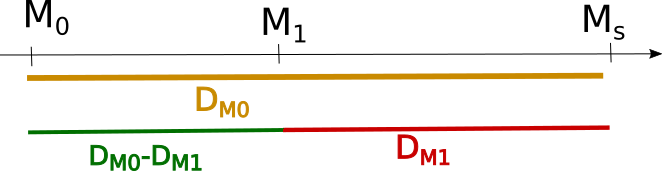
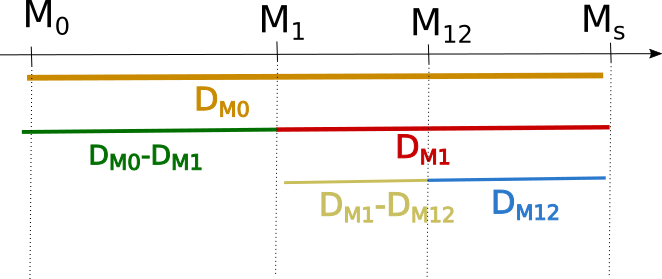

```{r setup, include=FALSE, eval = TRUE}
source(paste0(params$setup_path, "knitr_setup.R"))
with_sol <- TRUE ## in order to control the output
with_course <- TRUE
library('flipbookr')
library(RefManageR)
library(coursesdata)
library(tidyverse)
library(ggplot2)
library(maps)
library(sf)
states <- st_as_sf(maps::map("state", plot = FALSE, fill = TRUE))
```

```{r xaringanExtra-share-again, echo=FALSE}
xaringanExtra::use_share_again()
```

```{r datapackage, eval = TRUE, echo = FALSE, warning = FALSE}
ggplot <- function(...) ggplot2::ggplot(...) + scale_fill_manual(values = wesanderson::wes_palette(name = "Darjeeling1")) + scale_color_manual(values = wesanderson::wes_palette(name = "Darjeeling1")) 
#remotes::install_github('MarieEtienne/coursesdata', force = TRUE)
```


```{r reference,  include=FALSE, cache=FALSE, eval = TRUE}
BibOptions(check.entries = FALSE,
           bib.style = "authoryear",
           cite.style = "alphabetic",
           style = "markdown",
           hyperlink = FALSE,
           dashed = FALSE)
myBib <- ReadBib("./lm.bib", check = FALSE)
```


name: intro
# Introduction

---
template: intro
## Etude de l'aire de répartition de la grenouille à pattes rouges

237 points d'eau références

Pour chacun
- `Source` source de l'information (Museum, Literature, PersCom ou Field Note),
- `Source2` précision sur la source,
- `Status` présence ou l'absence de grenouilles
- `Latitude` latitude
- `Longitude` longitude
--

```{r data_grenouilles, eval = TRUE, echo = TRUE}
data("grenouilles")
head(grenouilles)
```


---
template: intro
## Etude de l'aire de répartition de la grenouille à pattes rouges


```{r map, eval = TRUE}
grenouilles_sf <- grenouilles  %>% st_as_sf(coords = c('Longitude','Latitude'), crs=4326) 
ggplot()  + geom_sf(data=states) + geom_sf(data= grenouilles_sf, aes(col = Status)) +
    coord_sf(xlim = c(-125, -90), ylim = c(20, 50), expand = FALSE) + scale_fill_manual(values = wesanderson::wes_palette(name = "Darjeeling1")) + scale_color_manual(values = wesanderson::wes_palette(name = "Darjeeling1")) 
```


---
template: intro
## Etude de l'aire de répartition de la grenouille à pattes rouges


```{r map_2, eval = TRUE}
ggplot()  + geom_sf(data=states) + geom_sf(data=grenouilles_sf, aes(col = Status))  +
    coord_sf(xlim = c(-124, -115), ylim = c(32, 42), expand = FALSE) + scale_fill_manual(values = wesanderson::wes_palette(name = "Darjeeling1")) + scale_color_manual(values = wesanderson::wes_palette(name = "Darjeeling1")) 
```


---
template: intro
## Etude de l'aire de répartition de la grenouille à pattes rouges

<a class=question> Peut on expliquer la présence de la grenouille à pattes rouges par la latitude ou la longitude ? </a>


---
template: intro
## Cadre général de la régression logistique 

On cherche à expliquer la 
- variable Y, qualitative (2 modalités) par
- des variables quantitatives

--
## Cadre du modèle linéaire généralisé

On cherche à expliquer la 
- variable Y,qui est  mal remprésentée par une loi normale
- des variables quantitatives et ou qualitatives.


---
template: intro
## Sur l'exemple Grenouille

La variable à expliquer $Y$ est la présence ou l'absence de grenouille

Les variables explicatives sont la latitude et la longitude

---
name: model
# Le modèle linéaire généralisé

---
template: model
## Rappel sur le modèle linéaire

$$\begin{align}
Y_k &\overset{ind}{\sim}\mathcal{N}( \mathbb{E}(Y_k) , \sigma^2)\\
& \mathbb{E}(Y_k) = X_i \theta,
\end{align}$$

et $X_i$ désigne la ligne $i$ de la matrice $X$.

--
## Le modèle linéaire généralisé

$$\begin{align}
Y_k &\overset{ind}{\sim}\mathcal{L}( \mathbb{E}(Y_k) , \phi )\\
& g(\mathbb{E}(Y_k)) = X_i \theta,
\end{align}$$


--
## Le modèlé linéaire est un modèle linéaire généralisé
$$\mathcal{L} =\mathcal{N},\quad g=Id$$


---
template: model
## Sur l'exemple Grenouille

- $Y_k$ présence ou absence de la grenouille au site $k$

--

$$Y_k \overset{ind}{\sim}\mathcal{B}(p_k)$$

--

- $p_k$ est la probabilité de présence au site $k$. 

On aimerait écrire
$$p_k = \beta_0 + \beta_1 x_{k}^{(1)} + \beta_2 x_{k}^{(2)}.$$

Mais $p_k$ est  un nombre entre 0 et 1 !!


---
count: false
template: model
## Sur l'exemple Grenouille

- $Y_k$ présence ou absence de la grenouille au site $k$


$$Y_k \overset{ind}{\sim}\mathcal{B}(p_k)$$


- $p_k$ est la probabilité de présence au site $k$. 


$$logit(p_k) = \beta_0 + \beta_1 x_{k}^{(1)} + \beta_2 x_{k}^{(2)}$$

--


```{r logit, eval = TRUE}
tibble(x= seq(0.00001, 0.9999, length.out = 1001)) %>% 
  mutate(y= log(x/(1-x))) %>% 
  ggplot() + 
  geom_line(aes(x=x, y=y)) + 
  xlab('p') +
  ylab('logit(p)')
```


$$logit(p) =\log{ \left (p /  (1-p) \right))}.$$


---
name: estimation
# Estimation des paramètres

---
template: estimation
## Rappel modèle linéaire

- Estimation des paramètres en minimisant RSS. 
- Ce qui revient à maximiser la vraisemblance i.e
$$L(\theta) = \prod_{k} \mathbb{P}_{\theta}(y_k)$$
--

- ou en encore la log vraisemblance
$$\ell(\theta) = \sum_{k} \log\left \{  \mathbb{P}_{\theta}(y_k) \right \} = \frac{n}{2} \log{\sigma^2} - \frac{1}{2} \sum_{k=1}^n \frac{(y_k - \hat{y}_k)^2}{\sigma^2}$$
--

- On obtient une formule explicite


---
template: estimation
## Modèle linéaire généralisé

- $\hat{\theta}$ qui maximise  la log vraisemblance

$$\ell(\theta) = \sum_{k} \log\left \{  \mathbb{P}_{\theta}(y_k) \right \}.$$
--

Malheureusement dans le cas général pas de formule explicite.

--

On utilise une optimsation numérique.

---
template: estimation
## Loi des estimateurs

Grâce à des résultats mathématiques, on a quand même

$${T} \underset{n\to\infty}{\sim} \mathcal{N}(\theta, \Sigma),$$
$\Sigma$ connu.

--

On peut faire des tests asymptotiques (si $n$ grand).


---
template: estimation
## Sur l'exemple des grenouilles

```{r estim, eval = TRUE, echo = FALSE}
grenouilles <- grenouilles %>% mutate(Status = factor(Status, levels =c('P', 'A')))
glm_comp <- glm( Status ~ Latitude  + Longitude , family = binomial(link="logit"), data = grenouilles )
summary(glm_comp)
```


---
name: test
# Test de comparaison de modèles
---
template: test
## Rappel modèle linéaire 


Les modèles sont comparés à l'aide de différences de RSS. Par exemple comparaison entre $M_0$ et $M_1$:

$$RSS_{M_0} - RSS_{M_1}$$

--

## Modèle linéaire généralisé

On définit la déviance d'un modèle $D_{M1}$ et l'idée sera de mesurer l'écart entre deux modèles par l'écart de déviance.

La déviance représente, comme RSS, la variabilité non capturée par le modèle


---
template: test
## Modèle linéaire généralisé

### Modèle saturé

On appelle modèle saturé $M_s$, le modèle ayant autant de paramètres que d'observations. C'est le modèle le plus ajusté possible. On note $\ell_{Sat}$ la vraisemblance de ce modèle.

### Déviance

La déviance pour un modèle $M_1$ est donné par

$$D_{M_1}= -2(\ell(\hat{\theta}) - \ell_{Sat} )$$

### Comparaison de modèles

Sous $H_0 : \left\lbrace M_1 \mbox{ et } M_0 \mbox{ sont équivalents}\right\rbrace,$

$$D_{M0} - D_{M1} \underset{n\to\infty}{\sim} \chi^2(p),$$
où le nombre de degrés de liberté $p$ est le nombre de paramètres d'écart entre les deux modèles.


---
template: test
## Graphiquement


<br>
<br>

```{r deviance1, eval =TRUE, out.width = "55%"}

```


---
template: test
## Test du modèle complet sur l'exemple des grenouilles


```{r glm_compare, eval = TRUE, echo = TRUE}
glm0 <- glm(Status ~ 1, family = binomial(link = logit), data = grenouilles)
anova(glm0, glm_comp, test = 'Chisq')
```


---
template: test
## Décomposition de type 1

```{r type1, eval = TRUE, echo = TRUE}
anova(glm_comp, test = 'Chisq')
```

--


```{r dec, eval = TRUE, echo = TRUE}
glm1 <- glm(Status ~ Latitude , family = binomial(link = "logit"), data = grenouilles)
glm2 <- glm(Status ~ Longitude, family = binomial(link = "logit"), data = grenouilles)
anova(glm0, glm1, test = 'Chisq')
```


---
template: test
## Décomposition de type 1


```{r deviance2, eval =TRUE, out.width = "55%"}

```

---
template: test
## Décomposition de type 2


```{r type2, eval = TRUE, echo = TRUE}
library(car)
Anova(glm_comp, test = 'LR')
```

--

```{r dec2, eval = TRUE, echo = TRUE}
anova(glm2, glm_comp, test = 'Chisq')

```

---
template: test
## Exercice 

Reprendre le dessin de décomposition du type 1 et l'adapter au type 2.


---
# Fin du cours


## Des questions ?

Ecrivez moi !!!

## Bon travail


```{r ggplot_back, echo = FALSe, eval = TRUE}
ggplot <- function(...) ggplot2::ggplot(...) 
```


