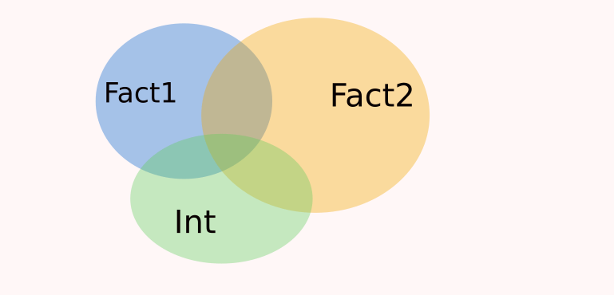
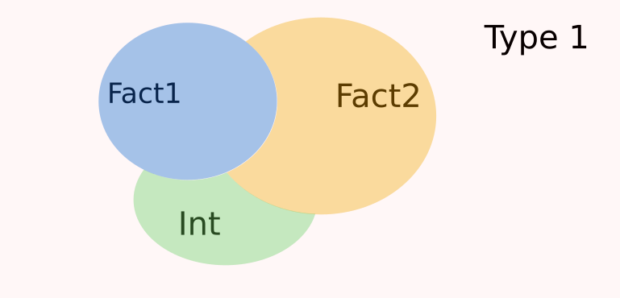
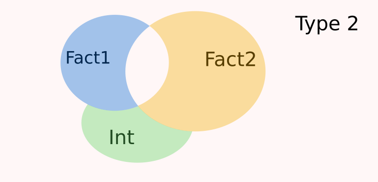
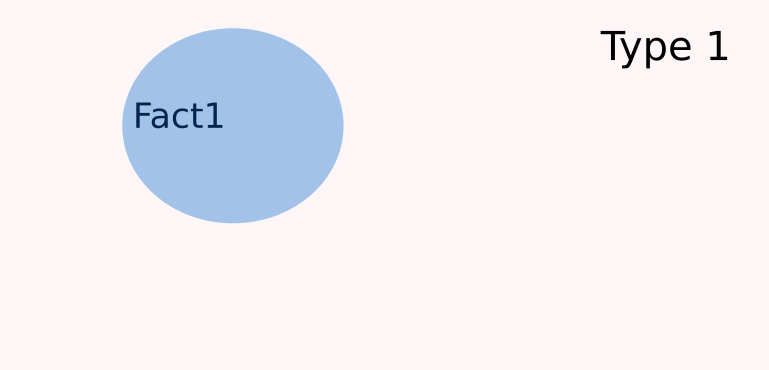
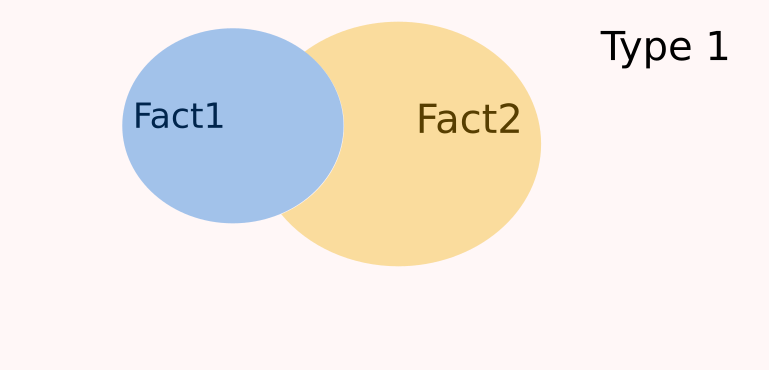
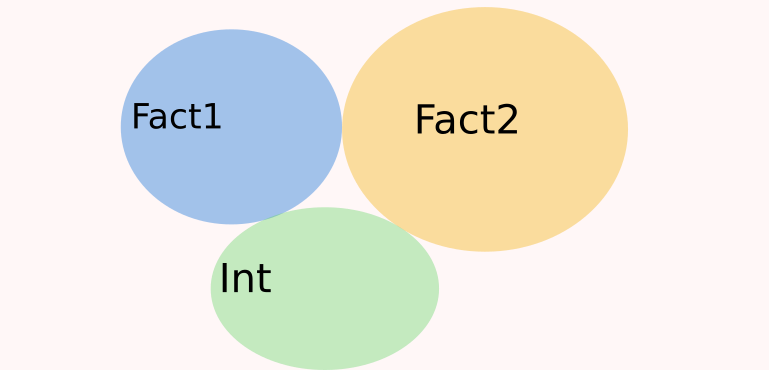

```{r setup, include=FALSE, eval = TRUE}
source(paste0(params$setup_path, "knitr_setup.R"))
with_sol <- TRUE ## in order to control the output
with_course <- TRUE
library('flipbookr')
library(RefManageR)
library(tidyverse)
library(ggplot2)
```

```{r xaringanExtra-share-again, echo=FALSE}
xaringanExtra::use_share_again()
```

```{r reference,  include=FALSE, cache=FALSE, eval = TRUE}
BibOptions(check.entries = FALSE,
           bib.style = "authoryear",
           cite.style = "alphabetic",
           style = "markdown",
           hyperlink = FALSE,
           dashed = FALSE)
myBib <- ReadBib("./lm.bib", check = FALSE)
```


name: intro
# Introduction

---
template: intro
## Etude de la pollution au SO2

On a mesuré pour 41 villes américaines, la pollution au SO2 ainsi que la population dans la viille

```{r datapackage, eval = TRUE, echo = FALSE, warning = FALSE}
ggplot <- function(...) ggplot2::ggplot(...) + scale_fill_manual(values = wesanderson::wes_palette(name = "Darjeeling1")) + scale_color_manual(values = wesanderson::wes_palette(name = "Darjeeling1")) 
#remotes::install_github('MarieEtienne/coursesdata', force = TRUE)
```

```{r usfata, eval = TRUE, echo = c(1,2), warning = FALSE}
library(coursesdata)
data(usdata)
usdata %>% ggplot() +  aes(x= pop, y = SO2)+  geom_point()
```


--
<p class="question"> La taille d'une ville est elle lidée à la pollution en SO2 ?</p>


---
template: intro
## Cadre général du modèle de régression simple

On étudie le lien entre  
- une variable quantitative notée $Y$ (la fréquence cardiaque),
- et une variable quantitative $x$.

Les données peuvent être visualisées à l'aide d'un nuage de points.


--
<p class="question"> La variable x a-t-elle un effet sur la variable Y ?</p>

---
name: model
# Le modèle de régression simple

---
template: model

## Graphiquement 

Une visualisation graphique du modèle d'analyse de la variance.

<br> <br> <br> <br>


Comment imagine-t-on le processus aléatoire qui a conduit à nos données ?


---

```{r reg_versiongraphique_prep, eval = TRUE, echo = FALSE}
set.seed(222)
n <- 20
x <- rnorm(n, mean= 10, sd = 2)
beta0 <- 1
beta1 <- 0.5
sigma <- 1
fake_dta <- tibble(x= x, y = rnorm(n, mean = beta0 + beta1*x, sd =sigma))  

x0 <- 8
norm_dta <- tibble::tibble(y = rnorm(1000, mean=beta0 + beta1*x0, sd= sigma), x= x0 + dnorm(x = y- beta0 - beta1*x0, mean= 0,  sd=0.5))

norm_dta0 <- tibble::tibble(y = rnorm(1000, mean=mean(fake_dta$y), sd= sigma), x= x0 + dnorm(x = y - mean(fake_dta$y), mean= 0,  sd=0.5))
```


```{r reg_versiongraphique}
ggplot(data=fake_dta) + 
  ylab('y') + xlim(range(fake_dta$x)) +ylim(range(fake_dta$y)) +
  ggtitle('Modèle Mcomp') +
  geom_abline(slope = beta1, intercept = beta0) + #BREAK
  geom_point(x=8, y=beta0+beta1*8, col = 'red', size=2) + #BREAK
  geom_point(data=norm_dta, aes(y=y, x=x), col = 'red', alpha=0.02) + #BREAK
  geom_point(aes(x=x, y=y)) 
```

`r chunk_reveal("reg_versiongraphique", break_type = "user", display_type="output")`

---


```{r reg_versiongraphique_M0}
ggplot(data=fake_dta) + 
  ylab('y') + xlim(range(fake_dta$x)) +ylim(range(fake_dta$y)) +
  ggtitle('Modèle nul') +
  geom_abline(slope = 0, intercept = mean(fake_dta$y)) + #BREAK
  geom_point(x=8, y = mean(fake_dta$y), col = 'red', size=2) + #BREAK
  geom_point(data=norm_dta0, aes(y=y, x=x), col = 'red', alpha=0.02) + #BREAK
  geom_point(aes(x=x, y=y)) 
```


`r chunk_reveal("reg_versiongraphique_M0", break_type = "user", display_type="output")`


```{r anova_versiongraphique_save, eval = TRUE}
pM0 <- ggplot(data=fake_dta) + 
  ylab('y') + xlim(range(fake_dta$x)) +ylim(range(fake_dta$y)) +
  ggtitle('Modèle nul') +
  geom_abline(slope = 0, intercept = mean(fake_dta$y)) + #BREAK
  geom_point(x=8, y = mean(fake_dta$y), col = 'red', size=2) + #BREAK
  geom_point(data=norm_dta0, aes(y=y, x=x), col = 'red', alpha=0.02) + #BREAK
  geom_point(aes(x=x, y=y)) 
pMcomp <- ggplot(data=fake_dta) + 
  ylab('y') + xlim(range(fake_dta$x)) +ylim(range(fake_dta$y)) +
  ggtitle('Modèle Mcomp') +
  geom_abline(slope = beta1, intercept = beta0) + #BREAK
  geom_point(x=8, y=beta0+beta1*8, col = 'red', size=2) + #BREAK
  geom_point(data=norm_dta, aes(y=y, x=x), col = 'red', alpha=0.02) + #BREAK
  geom_point(aes(x=x, y=y)) 
```


---
template: model

Lequel de ces mécanismes est le plus crédible au vu des donées ?

```{r compare_model_graph, eval = TRUE, echo = FALSE}
ggpubr::ggarrange(pMcomp, pM0, nrow = 1, common.legend = TRUE)
```

---
template: model

## Le modèle de régression simple 

$$Y_{k} = \beta_0 +\beta_1 x_{k}  +E_{k},\quad E_{k}\overset{ind}{\sim}\mathcal{N}(0, \sigma^2),$$
avec 
- $x_k$ la valeur de la variable explicative pour l'observation $k$, 
- $k=1,\ldots,n$ le numéro d'individus, $n$ le nombre total d'individus,
- $\beta_0$ l'ordonnée à l'origine, 
- $\beta_1$ la pente de la droite, mesure de l'effet de la variable $x$

- $\sigma^2$ la variance.

### Une écriture équivalente 

$$Y_{k} \overset{ind}{\sim}\mathcal{N}(\beta_0+\beta_1 x_k, \sigma^2).$$


### Nombre de paramètres du modèle

- $2$ paramètres de moyenne  $(\beta_0, \beta_1)$; 
- 1 paramètre de variance $\sigma^2$

---
template: model

## Le modèle de régression simple sur l'exemple de la pollution.

$$Y_{k} = \beta_0 +\beta_1 x_{k}  +E_{k},\quad E_{k}\overset{ind}{\sim}\mathcal{N}(0, \sigma^2),$$
avec 
- $x_k$ la population dans la ville $k$, 
- $k=1,\ldots,n$ le numéro de la ville, $n=41$,
- $\beta_0$ l'ordonnée à l'origine, 
- $\beta_1$ la pente de la droite, mesure de l'effet de la population sur la pollution.

- $\sigma^2$ la variance.

### Nombre de paramètres du modèle
- 2 paramètres de moyennes
- 1 paramètre de variance


---
template: model
## Sous forme matricielle
 $$\bf{Y = X\theta + E}$$
### Forme régulière 

$$Y=\begin{pmatrix}
Y_{1}\\
Y_{2}\\
\vdots\\
Y_{k}\\
\vdots\\
Y_{n}\end{pmatrix},
 \quad
{\bf{X}} =\overset{\color{gray}{\begin{matrix}\beta_0  & \beta_1\end{matrix}}}{\begin{pmatrix}
1 & x_1\\
1 & x_2\\
\vdots & \vdots\\
1 & x_k\\
 \vdots & \vdots\\
1 & x_n\\
 \end{pmatrix}},\quad
{\bf{\theta}} =\begin{pmatrix}
\beta_0\\
\beta_1\\
\end{pmatrix}, \quad{\bf{E}} = \overset{}{\begin{pmatrix}
E_{1}\\
E_{2}\\
\vdots\\
E_{k}\\
\vdots\\
E_{n}\\
\end{pmatrix}}$$
---
template: model

## Exercice

<p class=question> Détailler le modèle sous forme matricielle pour l'exemple de la pollution (écrire les 3 premières lignes de la matrice $X$ )</p>

--
Attention, la réponse est dans la slide qui suit !


---
template: model

## Correction 


```{r m_comp_false, eval = TRUE, echo = TRUE, out.width="100%"}
Mcomp <- lm(SO2 ~ pop , data = usdata)
model.matrix(Mcomp) %>% head(n = 3)
```
---
name: parametre
# Estimation des paramètres


---
template: parametre
## Estimation des paramètres du modèle version matricielle


Le modèle sous forme matricielle s'écrit

$$\bf{Y = X\theta + E}.$$
--

### Estimation de $\theta$

$$\hat{\theta} = (X^\intercal X )^{-1} X^\intercal Y_{obs}.$$

--

### Estimateur de $\theta$

$$T = (X^\intercal X )^{-1} X^\intercal Y.$$
--

### Loi de l'estimateur de $\theta$


$$T  \sim \mathcal{N}_{I}\left(\theta, \sigma^2 (X^\intercal X )^{-1}\right).$$

---
template: parametre
## Le paramètre de variance

La somme des carrés résiduelles s'écrit sous la forme 

$$RSS = || Y- X \hat{\theta} ||^2$$

### Estimateur de la variance 

  $$S^2 =\frac{1}{DF_{res}} RSS, $$
est un <a class=care> estimateur sans bias de  $\sigma^2$ </a> .

Dans le cas du modèle de régression simple  $DF_{res}=n-2$ (n observations et 2 paramètres de moyennes à estimer, le nombre de composantes dans le vecteur $\theta$)

--

## Estimation de $\sigma^2$

$$\hat{\sigma}^2 =\frac{1}{n-2} RSS_{obs}.$$
---
template: parametre
## Vérifier l'estimation sur l'exemple de la pollution


```{r estimation, eval = TRUE, echo = TRUE}
X <- model.matrix(Mcomp)
XXprimemoinsUn <- solve(t(X)%*%X)
XXprimemoinsUn %*% t(X) %*% matrix(usdata$SO2, ncol =1)
summary(Mcomp)$coefficients
```
--
Loi de l'estimateur

```{r loi_estim,  eval = TRUE, echo = TRUE}
summary(Mcomp)$sigma^2 * XXprimemoinsUn 
sqrt(diag(summary(Mcomp)$sigma^2 * XXprimemoinsUn ))
```


---
template: model

## Le modèle de régression multiple

Plusieurs variables sont potentiellement liées à la pollution enSO2


- temp : Average temperature in Fahrenheit
- manuf : No. of companies employing more than 20 employees
- pop : Population in thousands
- wind : Average annual wind speed in miles/hour
- precip : annual precipitation height in inches
- days : No. of days of precipitation


<a class=question> Quelles sont les variables liées à la pollution en SO2 ? </a>

---
template: model

## Le modèle de régression multiple 

$$Y_{k} = \beta_0 +\beta_1 x_{k}^{1}  + \beta_2 x_{k}^{2} + \ldots +  \beta_p x_{k}^{p}  +  E_{k},\quad E_{k}\overset{ind}{\sim}\mathcal{N}(0, \sigma^2),$$
avec 
- $x_{k}^{l}$ la valeur de la variable explicative $l$ pour l'observation $k$, 
- $k=1,\ldots,n$ le numéro d'individus, $n$ le nombre total d'individus,
- $\beta_0$ l'ordonnée à l'origine, 
- $\beta_l$ l'effet de la variable $X^{l}$ sur la variable à expliquer,
- $\sigma^2$ la variance.

### Une écriture équivalente 

$$Y_{k} \overset{ind}{\sim}\mathcal{N}\beta_0 +\beta_1 x_{k}^{1}  + \beta_2 x_{k}^{2} + \ldots +  \beta_p x_{k}^{p} , \sigma^2).$$


### Nombre de paramètres du modèle

- $l+1$ paramètres de moyenne  $(\beta_0, \beta_1, \ldots, \beta_l)$; 
- 1 paramètre de variance $\sigma^2$

---
template: model
## Sous forme matricielle
 $$\bf{Y = X\theta + E}$$
### Forme régulière 

$$Y=\begin{pmatrix}
Y_{1}\\
Y_{2}\\
\vdots\\
Y_{k}\\
\vdots\\
Y_{n}\end{pmatrix},
 \quad
{\bf{X}} =\overset{\color{gray}{\begin{matrix}\beta_0  && \beta_1&& \beta_2&&\ldots &&\beta_l\end{matrix}}}{\begin{pmatrix}
1 & x_1^{1} & x_1^{2} & \ldots &x_1^{l}\\
1 & x_2^{1} & x_2^{2} & \ldots &x_2^{l}\\
\vdots & \vdots& \vdots && \vdots\\
1 & x_k^{1} & x_k^{2} & \ldots &x_k^{l}\\
 \vdots & \vdots& \vdots && \vdots\\
1 & x_n^{1} & x_n^{2} & \ldots &x_n^{l}\\
 \end{pmatrix}},\quad
{\bf{\theta}} =\begin{pmatrix}
\beta_0\\
\beta_1\\
\beta_2\\
\vdots\\
\beta_l\\
\end{pmatrix}, \quad{\bf{E}} = \overset{}{\begin{pmatrix}
E_{1}\\
E_{2}\\
\vdots\\
E_{k}\\
\vdots\\
E_{n}\\
\end{pmatrix}}$$

---
template: model

## Sur l'exemple de la pollution


```{r m_comp_mult, eval = TRUE, echo = TRUE, out.width="100%"}
Mcomp <- lm(SO2 ~ . - City , data = usdata) # toutes les variables sauf City
model.matrix(Mcomp) %>% head(n = 3)
```
---
name: parametre
# Estimation des paramètres


---
template: parametre
## Estimation des paramètres du modèle version matricielle


Le modèle sous forme matricielle s'écrit

$$\bf{Y = X\theta + E}.$$
--

### Estimation de $\theta$

$$\hat{\theta} = (X^\intercal X )^{-1} X^\intercal Y_{obs}.$$

--

### Estimateur de $\theta$

$$T = (X^\intercal X )^{-1} X^\intercal Y.$$
--

### Loi de l'estimateur de $\theta$


$$T  \sim \mathcal{N}_{I}\left(\theta, \sigma^2 (X^\intercal X )^{-1}\right).$$

---
template: parametre
## Le paramètre de variance

La somme des carrés résiduelles s'écrit sous la forme 

$$RSS = || Y- X \hat{\theta} ||^2$$

### Estimateur de la variance 

  $$S^2 =\frac{1}{DF_{res}} RSS, $$
est un <a class=care> estimateur sans bias de  $\sigma^2$ </a> .

Dans le cas du modèle de régression simple  $DF_{res}=n-l-1$ (n observations et 2 paramètres de moyennes à estimer, le nombre de composantes dans le vecteur $\theta$)

--

## Estimation de $\sigma^2$

$$\hat{\sigma}^2 =\frac{1}{n-l-1} RSS_{obs}.$$
---
template: parametre
## Vérifier l'estimation sur l'exemple de la pollution


```{r estimation_mult, eval = TRUE, echo = TRUE}
X <- model.matrix(Mcomp)
XXprimemoinsUn <- solve(t(X)%*%X)
XXprimemoinsUn %*% t(X) %*% matrix(usdata$SO2, ncol =1)
summary(Mcomp)$coefficients
```
--
Loi de l'estimateur

```{r loi_estim_mult,  eval = TRUE, echo = TRUE}
sqrt(diag(summary(Mcomp)$sigma^2 * XXprimemoinsUn ))
```


---
name: modcomp
# Test du modèle complet


---
template: modcomp
## Pollution 

<p class="question"> La pollution en SO2 dans les villes américaines est elles liées à l'une au moins des variables caractérisiques des villes ?</p>


-- 

On va à la pêche ....

---
template: modcomp
## Sous forme de comparaison de modèle


```{r compare_model_graph2, ref.label='compare_model_graph', eval = TRUE, echo = FALSE, results='markup'}
```

--
<p class="question"> Le modèle Mcomp est il plus pertinent que le modèle M0 ?</p>


---
template: modcomp
## Hypothèses du test

On va donc opposer une hypothèse de travail $H_0$ contre une hypothèse alternative $H_1$. $H_0$ peut donc prendre différentes formes:


$$\begin{align} 
H_0 & =\left \lbrace \mbox{Auncune variable n'est liée à la pollution en SO2}\right\rbrace\\
    & =\left \lbrace  \mbox{pour tout p\geq 1, \beta_p =0   \right\rbrace\\
    & =\left \lbrace  M_{comp} \mbox{ est équivalent à } M0 \right\rbrace.
\end{align}$$


$H_1$ prend les formes équivalentes suivantes

$$\begin{align} 
H_1 & =\left \lbrace \mbox{Au moins 1 variable est liée à la pollution en SO2}\right\rbrace\\
    & =\left \lbrace  \mbox{Il existe un } p, \beta_p \ne 0  \right\rbrace\\
    & =\left \lbrace  M_{comp} \mbox{ est préférable à } M0 \right\rbrace.
\end{align}$$

--

Sous $H_0$, 
$$F= \frac{\frac{SS_{M_{comp}}}{l}}{\frac{RSS}{n-l-1}} \underset{H_0}{\sim}\mathcal{F}(l, n-l-1)$$  

---
template: modcomp
## Loi de la statistique de test sous $H_0$ - graphiquement

Sous $H_0$ la loi de distribution de $F$ est 

```{r p_value, eval = TRUE}
tibble(x = seq(0, 10, length.out = 2001)) %>% 
  mutate(y = df(x, df1 = 4, df= 38)) -> chi_dta
Fobs <- 1
chi_dta %>% filter(x> Fobs) %>% add_row(x=100,y = 0) %>%  add_row(x=Fobs, y =0)  %>% 
  add_row(x=Fobs, y =df(Fobs, df1 = 4, df= 38)) %>% arrange(x,y)  -> chi_dta_poly
```


```{r pvalue_graphique}
ggplot(data  = chi_dta) + xlab('y') + ylab('density') + geom_line(aes(x=x, y=y)) + #BREAK
  annotate("text", x = Fobs- 0.5, y = 0.05, label = "Fobs", col = 'red')+  geom_vline(aes(xintercept = Fobs), col = 'red') + #BREAK
  geom_polygon(data = chi_dta_poly,  aes(x=x, y= y), alpha = 0.3) + xlim(c(0, max(chi_dta$x))) 

```

---

`r chunk_reveal("pvalue_graphique", break_type = "user", display_type="output")`

---
name: variance_decomposition
# Decomposition de SSM

---
template: variance_decomposition
## Visualisation graphique de la décomposition de la variance

<br>

- $RSS_0$ est schématisée par le retangle  ci dessous.
- La partie rouge correspond à $RSS$.


<br>


```{r var_1, eval =TRUE, out.width = "55%"}

```

---
count:false
template: variance_decomposition
## Visualisation graphique de la décomposition de la variance

<br>

- $RSS_0$ est schématisée par le retangle  ci dessous.
- La partie rouge correspond à $RSS$.


<br>

```{r var_2, eval =TRUE, out.width = "55%"}

```

---
count:false
template: variance_decomposition
## Visualisation graphique de la décomposition de la variance

<br>

- $RSS_0$ est schématisée par le retangle  ci dessous.
- La partie rouge correspond à $RSS$.


<br>

```{r var_3, eval =TRUE, out.width = "55%"}

```
---
count:false
template: variance_decomposition
## Visualisation graphique de la décomposition de la variance

<br>

- $RSS_0$ est schématisée par le retangle  ci dessous.
- La partie rouge correspond à $RSS$.

<br>

```{r var_4, eval =TRUE, out.width = "55%"}

```

---
count:false
template: variance_decomposition
## Visualisation graphique de la décomposition de la variance

<br>

- $RSS_0$ est schématisée par le retangle  ci dessous.
- La partie rouge correspond à $RSS$.


<br>

```{r var_5, eval =TRUE, out.width = "55%"}

```


---
template: variance_decomposition
## Mathématiquement

On veut décomposer la variabilité attribuée au modèle selon les différentes sources.

Considérons les différents modèles possibles

$$\begin{align}
M_0\ :\ Y_{ijk} &= \mu + E_{ijk}\\
M_{1}\ :\ Y_{ijk} &= \mu + \alpha_i + E_{ijk}\\
M_{2}\ :\ Y_{ijk} &= \mu + \beta_j + E_{ijk}\\
M_{12}\ :\ Y_{ijk} &= \mu + \alpha_i + \beta_j + E_{ijk}\\
M_{comp}\ :\ Y_{ijk} &= \mu + \alpha_i + \beta_j +\gamma_{ij} + E_{ijk}\\
\end{align}$$

--

<a class = question> Comment mesurer l'effet des différents facteurs</a> 

--

Mesurer la réduction de variabilité liée à la prise en compte d'un facteur.

---
template: variance_decomposition
## Réduction de variabilité

$$\begin{align}
SSM & = RSS_0 - RSS_{comp}\\
SSM & = \underbrace{RSS_0 - RSS_{1}}_{R(\alpha\vert \mu )} + {RSS_1 - RSS_{12}} +{RSS_{12} - RSS_{comp}} \\
\end{align}$$
--


```{r var_ralpha, eval =TRUE, out.width = "55%"}

```


---
count: false
template: variance_decomposition
## Réduction de variabilité

$$\begin{align}
SSM & = RSS_0 - RSS_{comp}\\
SSM & = \underbrace{RSS_0 - RSS_{1}}_{R(\alpha\vert \mu )} + \underbrace{RSS_1 - RSS_{12}}_{R(\beta\vert\alpha,\mu)} + {RSS_{12} - RSS_{comp}} \\
\end{align}$$


```{r var_beta, eval =TRUE, out.width = "55%"}

```


---
count: false
template: variance_decomposition
## Réduction de variabilité

$$\begin{align}
SSM & = RSS_0 - RSS_{comp}\\
SSM & = \underbrace{RSS_0 - RSS_{1}}_{R(\alpha\vert \mu )} + \underbrace{RSS_1 - RSS_{12}}_{R(\beta\vert\alpha,\mu)} + \underbrace{RSS_{12} - RSS_{comp}}_{R(\gamma\vert \beta, \alpha, \mu)} \\
\end{align}$$


```{r var_tot, eval =TRUE, out.width = "55%"}

```


---
template: variance_decomposition
## Test de type 1


 <table style="width:100%">
  <tr>
    <th>Source</th>
    <th>H0</th>
    <th>SS</th>
    <th>Df</th>
    <th>F</th>
  </tr>
  <tr>
    <th> Fact1 </th>
    <th> M0 et M1 sont équivalents </th>
    <th> $R(\alpha\vert \mu)$ </th>
    <th> $I-1$ </th>
    <th> $$\frac{\frac{R(\alpha\vert \mu)}{I-1}}{\frac{RSS}{n-IJ}}$$ </th>
</tr>
<tr>
    <th> Fact2 </th>
    <th> M1 et M12 sont équivalents </th>
    <th> $R(\beta\vert\alpha, \mu)$ </th>
    <th> $J-1$ </th>
    <th> $$\frac{\frac{R(\beta\vert \alpha, \mu)}{J-1}}{\frac{RSS}{n-IJ}}$$ </th>
</tr>
<tr>
    <th> Inter </th>
    <th> M12 et Mcomp sont équivalents </th>
    <th> $R(\gamma\vert \beta, \alpha, \mu)$ </th>
    <th> $(J-1)(J-1)$ </th>
    <th> $$\frac{\frac{R(\gamma\vert \beta, \alpha, \mu)}{(I-1)(J-1)}}{\frac{RSS}{n-IJ}}$$ </th>
</tr>
</table> 


---
template: variance_decomposition
## Tests de type 1

Rôle asymétrique des facteurs (l'ordre des facteurs importe).

--

## Tests de type 2

But : symétriser le rôle des différents facteurs

```{r var_tot_2, eval =TRUE, out.width = "45%"}

```


---
template: variance_decomposition
## Test de type 2

 <table style="width:100%">
  <tr>
    <th>Source</th>
    <th>H0</th>
    <th>SS</th>
    <th>Df</th>
    <th>F</th>
  </tr>
  <tr>
    <th> Fact1 </th>
    <th> M2 et M12 sont équivalents </th>
    <th> $R(\alpha\vert \beta, \mu)$ </th>
    <th> $I-1$ </th>
    <th> $$\frac{\frac{R(\alpha\vert\beta, \mu)}{I-1}}{\frac{RSS}{n-IJ}}$$ </th>
</tr>
<tr>
    <th> Fact2 </th>
    <th> M1 et M12 sont équivalents </th>
    <th> $R(\beta\vert\alpha, \mu)$ </th>
    <th> $J-1$ </th>
    <th> $$\frac{\frac{R(\beta\vert \alpha, \mu)}{J-1}}{\frac{RSS}{n-IJ}}$$ </th>
</tr>
<tr>
    <th> Inter </th>
    <th> M12 et Mcomp sont équivalents </th>
    <th> $R(\gamma\vert \beta, \alpha, \mu)$ </th>
    <th> $(J-1)(J-1)$ </th>
    <th> $$\frac{\frac{R(\gamma\vert \beta, \alpha, \mu)}{(I-1)(J-1)}}{\frac{RSS}{n-IJ}}$$ </th>
</tr>
</table> 

---
template: variance_decomposition
## L'exemple des fréquence cardiaque

### Type 1
```{r freq_comp, eval = TRUE, echo =TRUE}
MComp <- lm(freqC ~ Sexe + Sport_Fact +Sexe:Sport_Fact, data = freqdata)
anova(MComp)
```

--
### Type 2

```{r freq_comp2, eval = TRUE, echo =TRUE}
library(car)
Anova(MComp, type = 2)
```

---
template: variance_decomposition
## L'exemple des fréquence cardiaque

Il s'agit du cas particulier $n_{ij}$ sont tous égaux. Le plan d'expérience est dit **équilibré**.

--


```{r var_eq, eval =TRUE, out.width = "45%"}

```


---
template: variance_decomposition
## Fréquence cardiaque, plan d'expérience déséquilibré

```{r freq_des, eval = TRUE, echo = c(2,4,5)}
freqdata_des <- read.table('https://marieetienne.github.io/datasets/FreqCardiaqueDes1.txt', sep =" ", header =TRUE) %>% 
  mutate(Sport_Fact = as.factor(Sport))
table(freqdata_des$Sexe, freqdata_des$Sport)
MComp <- lm(freqC ~ Sexe + Sport_Fact + Sexe:Sport_Fact, data = freqdata_des)
anova(MComp)
Anova(MComp, type = 2)
```


---
template: variance_decomposition
## Exercice

Indiquer dans chaque portion du schéma ci-dessous, le somme des carrés représentés. 


```{r var_tot_ex, eval =TRUE, out.width = "55%"}

```

---
template: pause

---
name: comp_moyenne
# Comparaison des différents groupes
---
template: comp_moyenne

## Question 

<a class=question> Quels sont les niveaux de pratiques sportives correspondant à des fréquences cardiaques différentes ?</a>

--

Calcul des moyennes par niveau de pratique sportive

```{r mean_sexe, eval = TRUE}
freqdata_des %>% group_by(Sport) %>%  summarise(m =mean(freqC)) 
```


Calcul des moyennes par sexe

```{r mean_sport, eval = TRUE}
freqdata_des %>% group_by(Sexe) %>%  summarise(m =mean(freqC)) 
```


--
<a style=care> Attention : </a> comparaison de femmes sportives avec des hommes sédentaires

Plan d'expérience

```{r plan_xp, eval = TRUE}
table(freqdata_des$Sexe, freqdata_des$Sport)
```


---
template: comp_moyenne

La moyenne au sein du groupe $i$ pour le facteur est 1 est donnée par :
$$Y_{i..} = \frac{1}{n_{i+}}\sum_{j=1}^J \sum_{k=1}^{n_ij}Y_{ijk},$$
avec $n_{i+}=\sum_j n_{ij},$ le nombre total d'observations pour le niveau $i$. 

Alors $$\mathbb{E}(Y_{i..} )= \mu + \alpha_i  + \frac{1}{n_{i+}}\sum_{j=1}^J  n_{ij} (\beta_j  +\gamma_{ij}).$$

--
Sur notre exemple
$$\mathbb{E}(Y_{1..} )= \mu  + \alpha_1 + \frac{1}{n_{i+}} \left( 6 (\beta_1 + \gamma_{11}) + 3 (\beta_2 + \gamma_{12})  + 5 (\beta_3 + \gamma_{13}) + 3 (\beta_4 + \gamma_{14})+ 2 (\beta_5 + \gamma_{15})\right).$$

$$\mathbb{E}(Y_{2..} )= \mu  + \alpha_2 + \frac{1}{n_{i+}} \left( 3 (\beta_1 + \gamma_{21}) + 2 (\beta_2 + \gamma_{22})  + 6 (\beta_3 + \gamma_{23}) + 5 (\beta_4 + \gamma_{24})+ 5 (\beta_5 + \gamma_{25})\right).$$

--

$$\begin{align}
\mathbb{E}(Y_{1..} - Y_{2..} )= & \alpha_1- \alpha_2 + \frac{1}{n_{i+}} \left( 3 \beta_1  + 6\gamma_{11}  - 3\gamma_{21} +\beta_2 + 3\gamma_{12}  - 2\gamma_{22} - \beta_3 +5\gamma_{13}  - 6\gamma_{23}\right. \\
& \left. -2\beta_4 + 3 \gamma_{14}  -  5\gamma_{24} -3 \beta_5 + 2 \gamma_{15} -5 \gamma_{25} \right).
\end{align}$$

Les effets potentiels de la pratique sportive n'interviennent pas de la même manière dans les deux moyennes.


---
template: comp_moyenne
## Moyennes ajustées

C'est la moyenne qu'on observerait dans un plan d'expérience équilibré

$$\tilde{\mu}_{i.} = \mu + \alpha_i + \frac{1}{J}\sum_{j=1}^J (\beta_j +\gamma_{ij}).$$
$$\tilde{\mu}_{.j} = \mu + \beta_j + \frac{1}{I}\sum_{i=1}^I (\alpha_i +\gamma_{ij}).$$


*On redresse artificiellement le plan d'expérience*
--

$$\tilde{\mu}_{1.}-\tilde{\mu}_{2.} =  \alpha_1  -\alpha_{2}+ \frac{1}{J}\sum_{j=1}^J (\gamma_{1j} -\gamma_{2j}).$$

---
template: comp_moyenne

## Moyennes ajustées pour le sexe

```{r moy_ajustees, eval= TRUE, echo =TRUE}
library(emmeans)
m_ajust_sexe <- emmeans(MComp, "Sexe")
pairs(m_ajust_sexe)
plot(m_ajust_sexe)
```


---

template: comp_moyenne
## Moyennes ajustées pour le sport

```{r moy_ajustees_sport, eval= TRUE, echo =TRUE}
m_ajust_sport <- emmeans(MComp, "Sport_Fact")
summary(pairs(m_ajust_sport))
```

---

template: comp_moyenne
## Moyennes ajustées pour le sport

```{r ajuste_sport_graph, eval = TRUE}
plot(m_ajust_sport)
```


